# Laboratorio 4

# Integrantes:

- Agustin Silva
- Alejandro Spitale
- Facundo Buc

## Introducción

## Modelo de Anillo

`Se entrega como kickstarter un modelo de red en anillo que consta de 8 nodos, cada uno con dos interfaces de comunicación full-duplex con dos posibles vecinos`

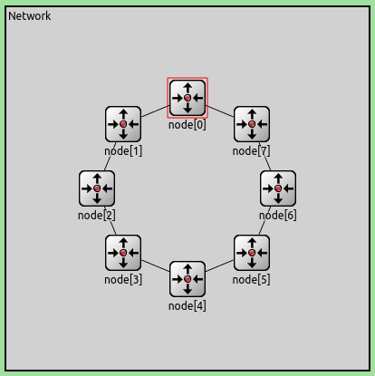

`Internamente, cada nodo cuenta con dos capas de enlace(link olnk, una con cada vecino),una capa de red (net) y una capa de aplicación (app).`

`La capa de aplicación y la capa deenlace implementan generadores de tráfico y buffers respectivamente.`

`Cada paquete que ésta recibe es evaluado para determinar si el nodo local es el destino final del mismo. En caso de que lo sea, el paquete es enviado a la capa de aplicación local. En caso de que el paquete esté destinado a otro nodo se elige una interface para re-transmitirlo.`

`La capa de red del kickstarter elige siempre la interfacenúmero 0 (toLnk[0]) que es la que envía el tráfico en sentido de las manecillas del reloj a lo largo del anillo hasta llegar al destino.`

## Tarea análisis

### Caso 1

`Se deberá correr el modelo con las fuentes de tráfico configuradas (​node[0]​ y`
`node[2]​ transmitiendo datos a ​node[5]​) y estudiar las métricas tomadas.`

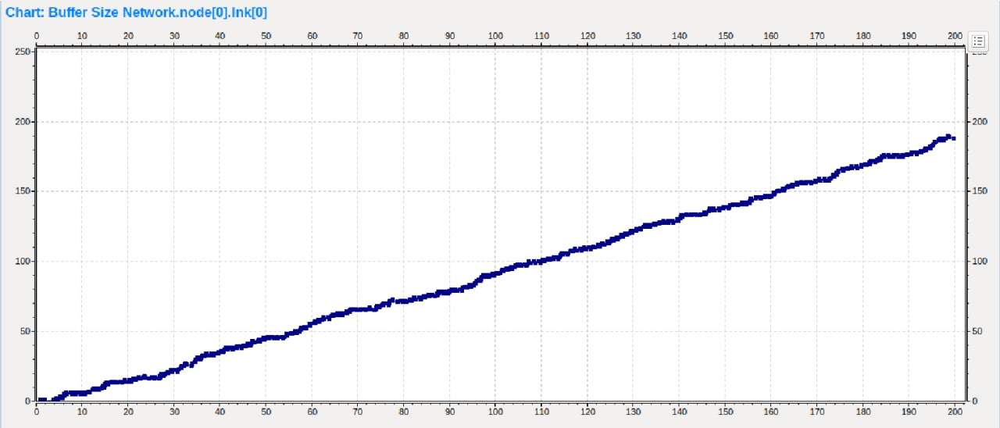

- Acá podemos ver que se genera congestion en el buffer del nodo 0,
ya que este buffer recibe constantemente paquetes tanto de su capa de aplicación como de los generados por el buffer 2.
- En cambio los demas buffers reciben los paquetes a la misma velocidad que los despachan.

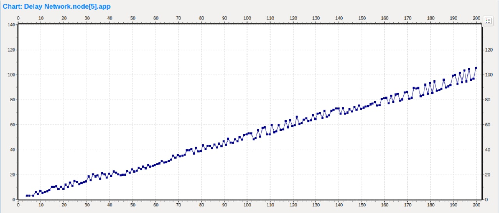

- Por lo dicho anteriormente la demora en llegar al nodo de destino 5 será cada vez mayor.

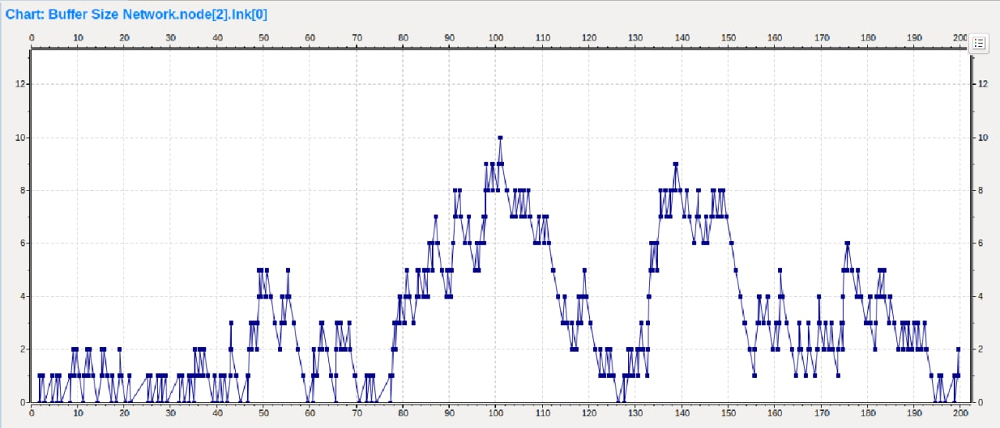

- Este buffer tendrá cambios ya que la velocidad con que la capa de aplicación genera paquetes es exponencial, mientras que la velocidad a la que los despacha es constante.

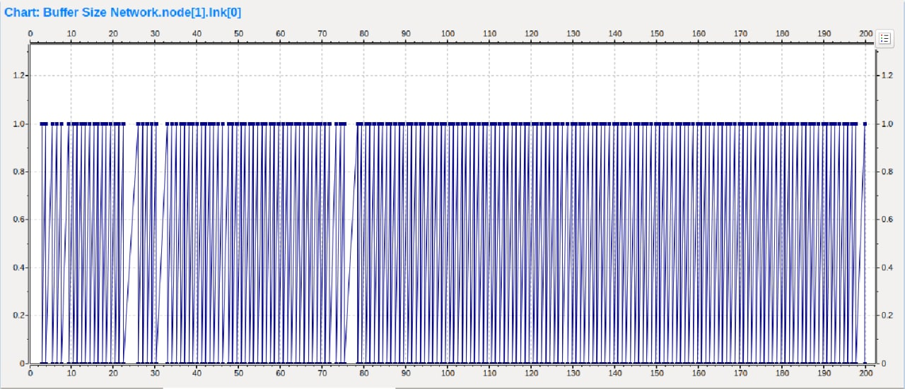

- Los buffer de los nodos 1, 6 y 7 estarán siempre oscilando entre 0 y 1, ya que la velocidad con que los reciben y despachan es constante.

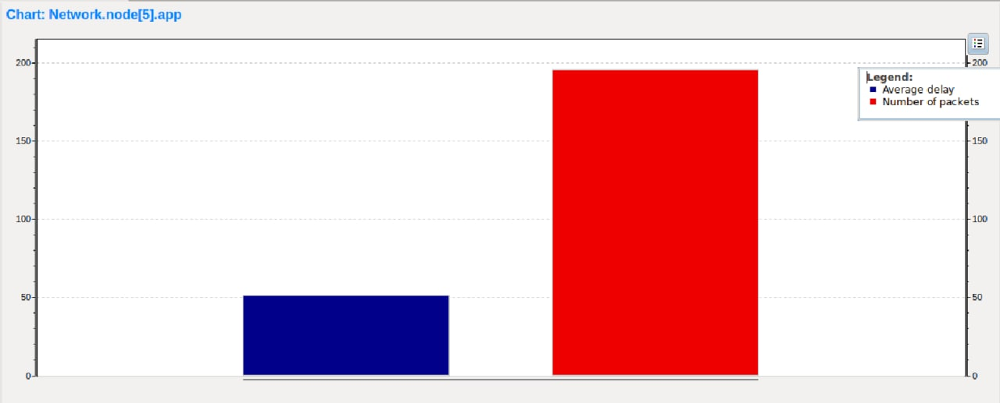

- Aqui podemos ver el promedio de delay de llegadas de paquetes al nodo destino, aprox 50s, y la cantidad de paquetes que llegaron, aprox 196.

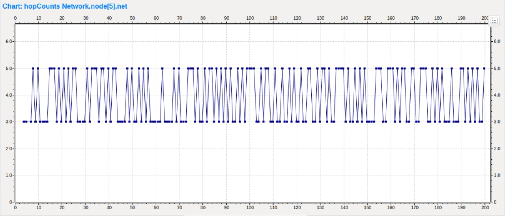
- En este gráfico podemos ver que el contador de saltos entre nodos oscila entre 3 y 5.
- Esto se debe a que al generarse desde el nodo 2 tenemos 5 saltos de nodos en el camino hasta el nodo de destino 5. Y al generarse desde el nodo 0 tenemos 3 saltos entre nodos hasta el nodo de destino 5.

### `Uso de los recursos de la red`

Observando las métricas obtenidas anteriormente, los nodos 3 y 4 están siempre en desuso, por lo que hay un desperdicio de los recursos de la red.

### ¿Se puede mejorar?

Una buena mejora sería que se envíen los datos hacias las dos salidas que tiene cada nodo.
- Una opcion sencilla sería enviar un paquete a cada salida.
- Otra es que se elija la salida de forma aleatoria.

### Caso 2

`Asuma ahora que todos los nodos (0,1,2,3,4,6,7,8)generan tráfico hacia elnode[5]conpacketByteSizeeinterArrivalTimeidénticosentre todos los nodos.Explore y determine a partir de qué valor deinterArrivalTimese puede garantizar unequilibrio o estabilidad en la red. Justifique.`

- Primero podemos observar que con un interArrivalTime identico al del caso uno, el uso de la red es ineficiente.

- Como el tamaño de los buffers y el tiempo de vida de cada paquete no tienen limite, por lo que no hay perdida de paquete, se asume que la red es inestable cuando el delay entre que un nodo se crea y llega a destino es muy cercano al tiempo de vida de la simulacion.

- Por lo que para que la red sea estable los buffers no deben tener un crecimiento constante si no que se mantengan en cierto limite, y el delay se mantenga constante y no crezca indefinidamente.

- Buscamos entonces un valor de InterArrivalTime tal que no sea muy grande, ya que estaríamos desperdiciando y limitando la velocidad de transferencia de la red, y tal que no sea muy chico ya que estaríamos sobrecargando los buffers de manera exponencial y generando un crecimiento del delay constante.

#### Caso 2: interArrivalTime = 1

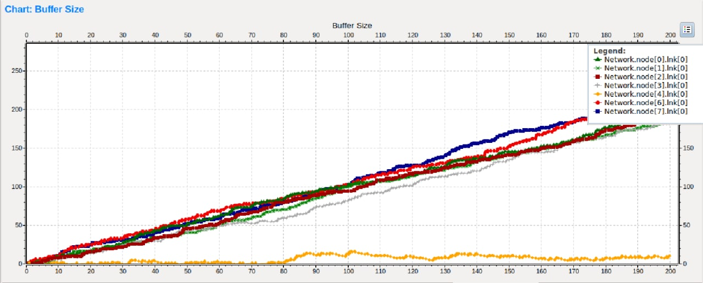

- Primero cabe resaltar que el buffer del nodo 4 es prácticamente constante pues solo genera paquetes y los envia, creando una ineficiencia en el uso de la red mandando los paquetes en sentido horario, cuando podría enviarlos en un solo salto al nodo destino.

- Entre los demás buffers, los más afectados son el 6 y 7, pues le llegan paquetes generados por los demás nodos, generando congestión en los mismos.

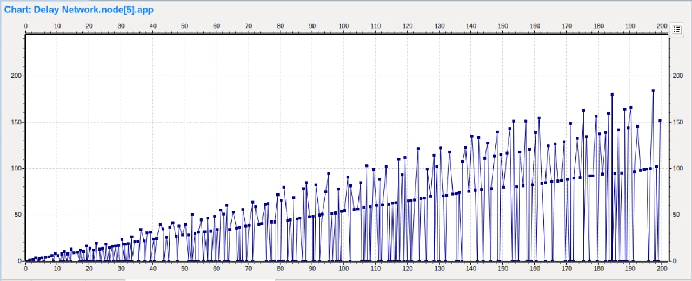

- Por lo explicado anteriormente, el delay crece constantemente, en este caso son 200s pero en una simulacion con tiempo mayo el delay no dejaria de crecer.

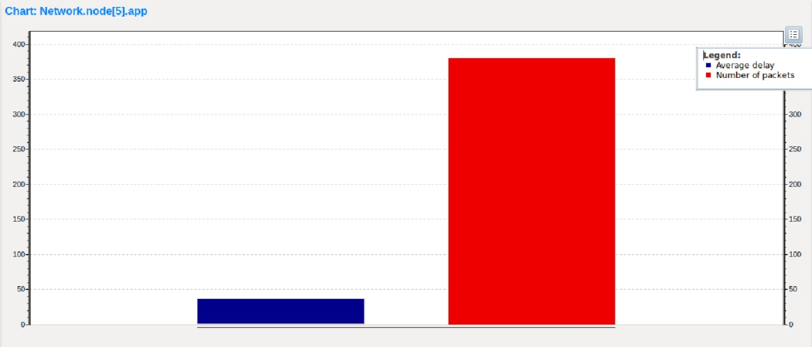

- El promedio de delay es aprox 40s, y un total de 375 paquetes recibidos en el nodo de destino.

### Caso 2: interArrivalTime = 7.1

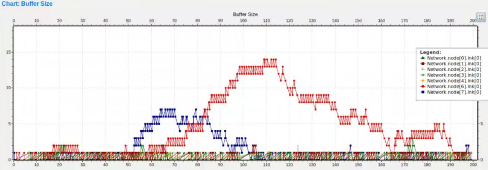

- Ahora los buffers no crecen constantemente, el buffer 6 y 7 son los que van a sufrir un poco de congestion pero no excesiva.

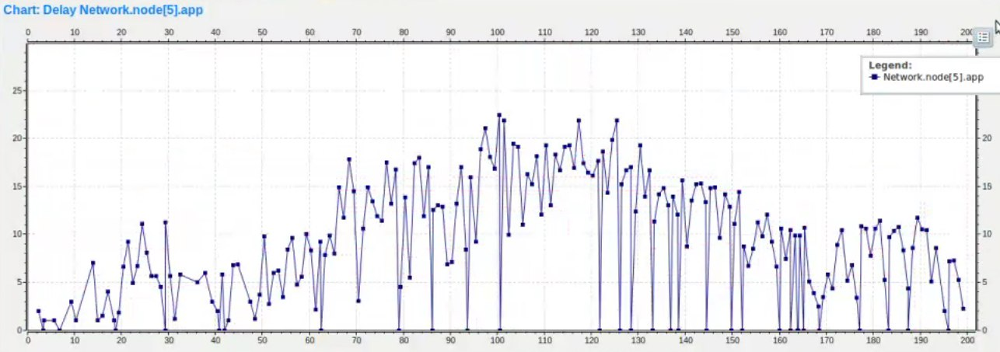

- El delay tampoco crece de manera constante, se mantiene dentro de un rango estable.

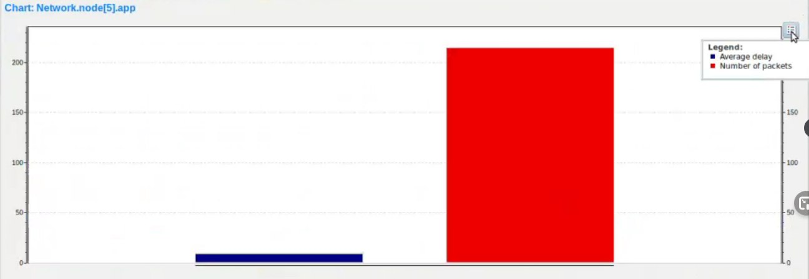

- El delay pasa a un valor aprox de 8s y la cantidad de paquetes recibidos en el nodo de destino en 200s es 215.

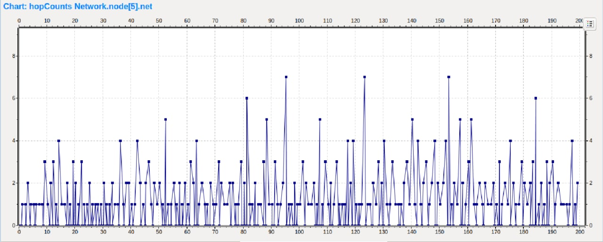

- La cantidad de saltos entre los dos interArrivalTime no varian pues el hacer un uso ineficiente de la red, hace que en vez en de buscar el camino mas corto envie los paquetes hacia la derecha.

## Diseño

### Caso 1

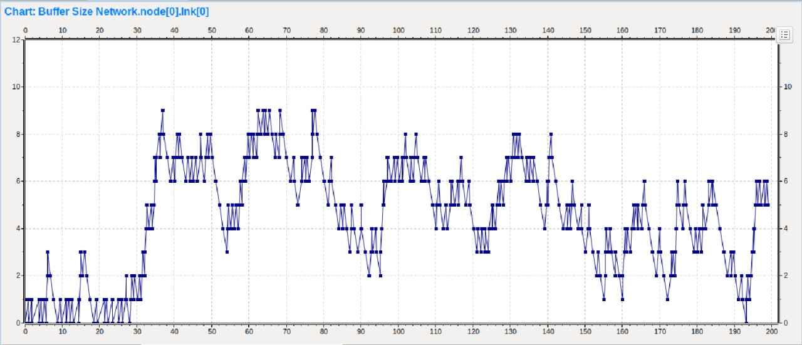

- Podemos ver como se mejora el problema de congestión en el nodo 0, ya que ahora estamos enviando los paquetes generados en el nodo 2 en sentido antihorario. Con esto estamos logrando un uso eficiente de la red.

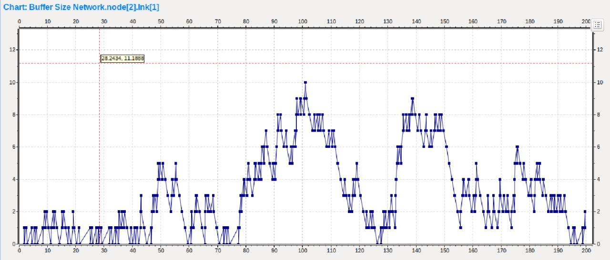

- La generación de este nodo esta igual que en la parte 1.

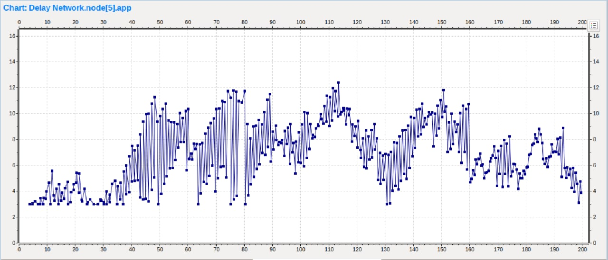

- Ahora podemos ver que el delay del buffer 5 ya no crece de manera constante, si no que mantiene valores estables.

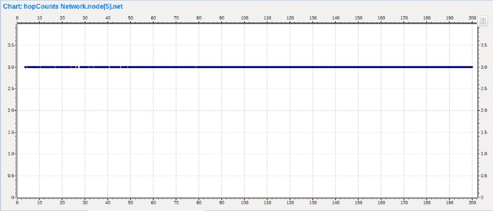

- A comparacion del caso anterior que hace un uso ineficiente de la red, en este caso los saltos son siempre 3, ya que tenemos el mejor camino hacia el destino en los dos nodos.

- El promedio de delay es aprox 6.9, y un total 379 paquetes recibidos en el nodo de destino.

## Caso 2

### InterArrivalTime = 1

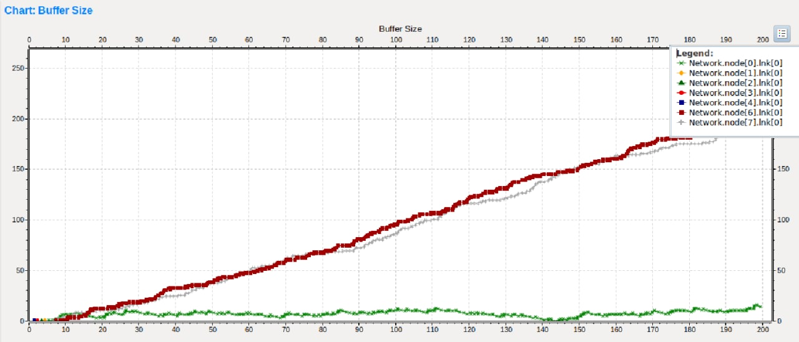

- Al principio todos los nodos generan paquetes hacia la izquierda, una vez que se setea la direccion de los nodos 6,7,0 envian paquetes hacia la derecha, entontonces el ink[0] para los demas nodos no se usa, el nodo 0 no sufre congestion pues genera y envia paquetes hacia la derecha, entonces mientras el nodo este mas cerca del destino mas congestion tendra.

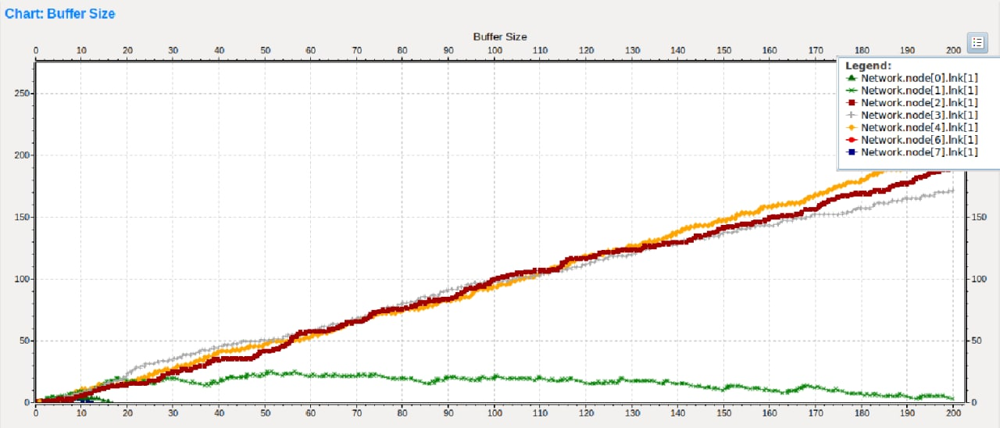

- Al principio todos los nodos generan paquetes hacia la izquierda, una vez que se setea la direccion los nodos del 1 al 4 envian paquetes hacia la izquierda, entonces el ink[1] para los demas nodos no se usa, el nodo 1 es el unico que no sufre de congestion pues lo unico que hace es generar paquetes y enviarlos, entonces mientras el nodo este mas cerca del destino mas congestion tendra.

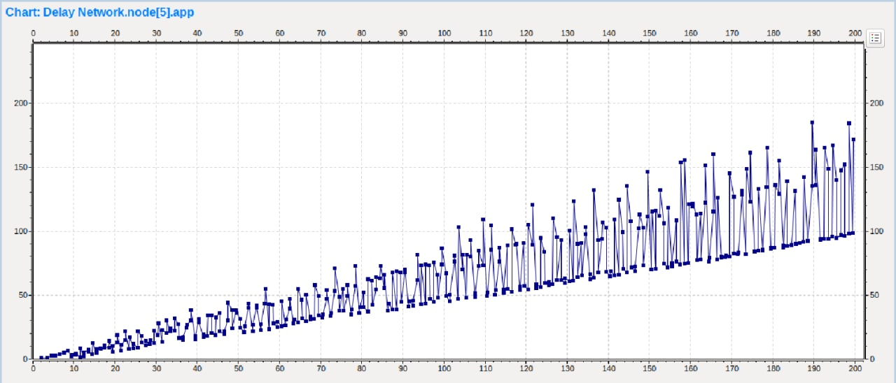

- El delay a comparacion de la implementacion anterior se mejora, pues se hace un uso mas eficiente.

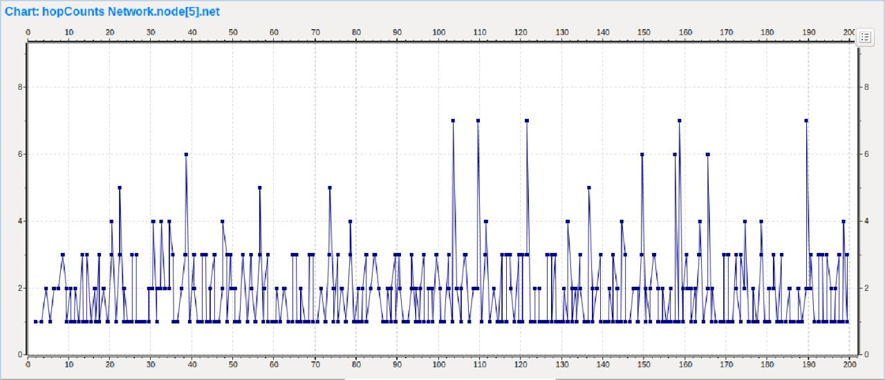

- Al generarse paquetes a gran velocidad tenemos la particularidad de encontrar varios saltos en medidas tardias del grafico
porque al principio del programa enviamos todos los paquetes generados en sentido antihorario y el paquete Start en sentido
horario para lograr equilibrar la red a medias, y los últimos paquetes enviados hacia el sentido antihorario de los nodos 0, 6 y 7
van a tener delay en llegar a destino por la congestión generada, y así mostrando la cantidad de saltos de dichos saltos en demora.

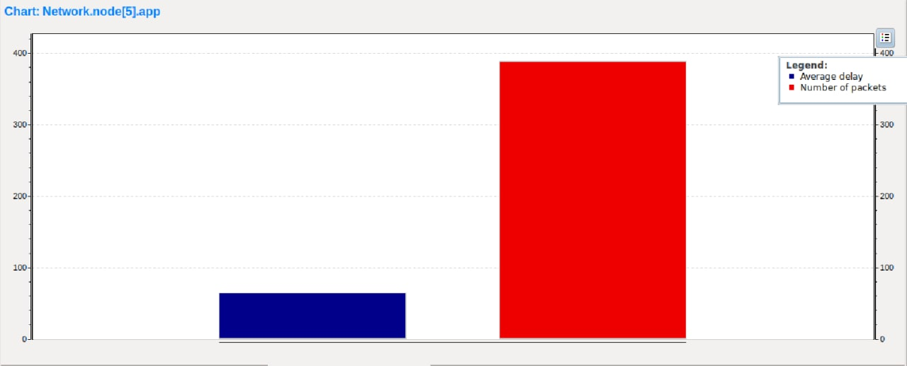

- El delay promedio es aprox 64, y un total de 389 paquetes recibidos en el nodo de destino.

### InterArrivalTime = 5

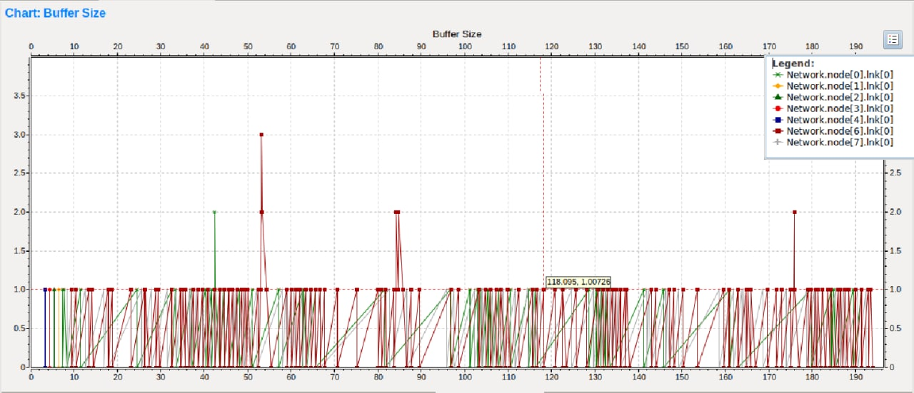

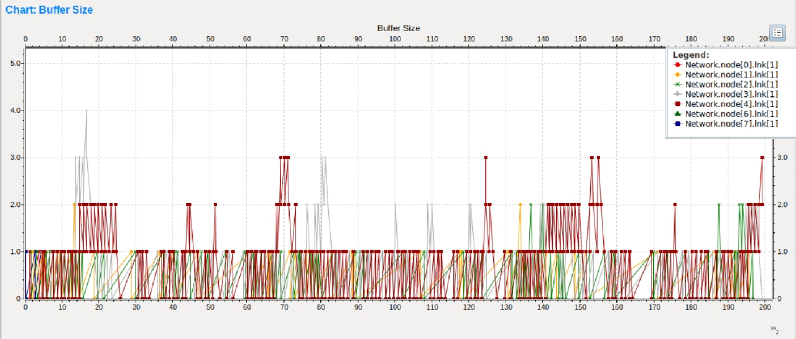

- Se puede observar que los buffers no van a sufrir congestion, pues no crecen constantemente como con un interArrivalTime de 1, es el caso optimo para el algoritmo implementado.

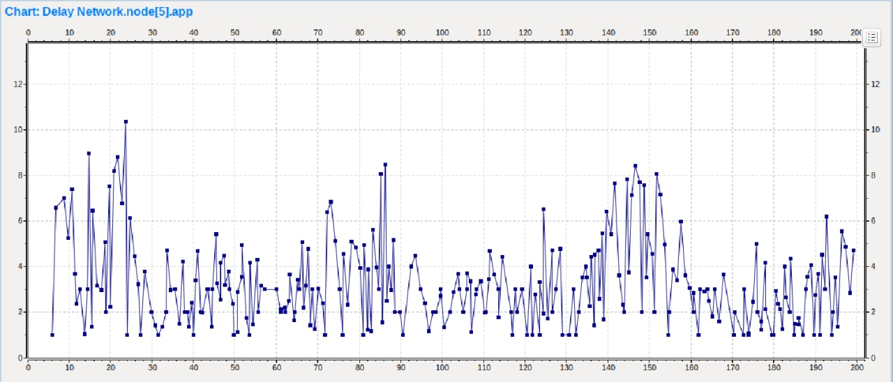

- Acá podemos ver que el delay del nodo 5 no supera los 11 segundos, y se mantiene con valores estables y bajos sin superar ese máximo.

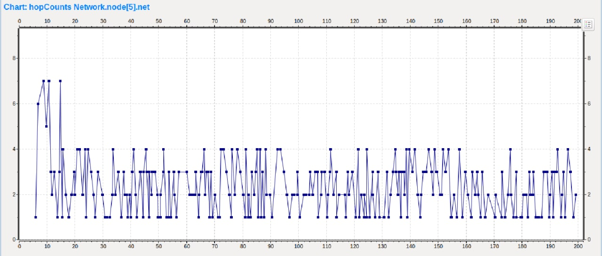

- En este caso los 7 saltos aparecen al principio, pues los buffers no se llenan tan rapido como con un interArrivalTime de 1.

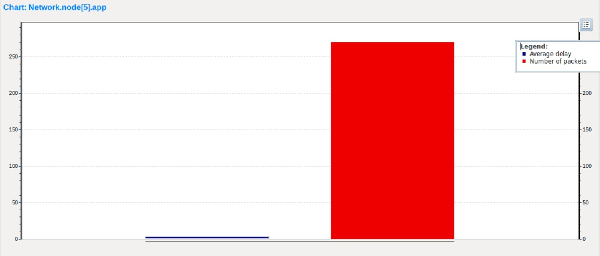

- El delay promedio es aprox 3.2, y un total de 271 paquetes recibidos en el nodo de destino.

## Preguntas:

1- ¿Cuánto mejoran las métricas? ¿Por qué?

- Las métricas mejoran aprox un 60% respecto al delay. Porque estamos haciendo un mejor uso de la red, y de enrutamiento de los nodos.

2- ¿Hay loops de enrutamiento?

- No ocurren, porque cada nodo sabe cual es su destino.

3- ¿Ve alguna manera demejorar más aún su diseño?

- Si, haciendo que el nodo 1 envie paquetes para la izquierda y derecha intercaladamente.
